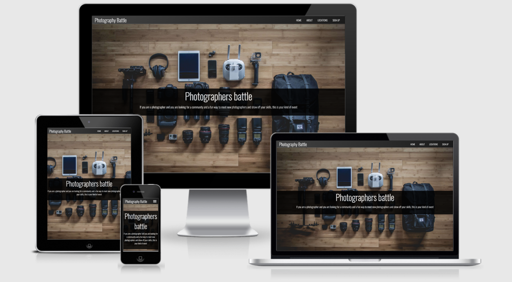
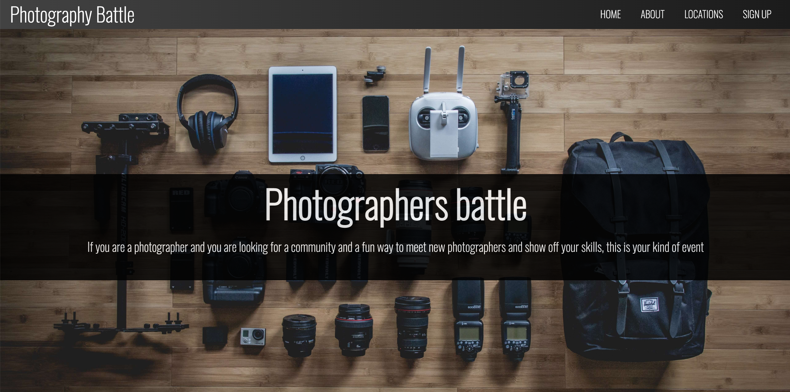
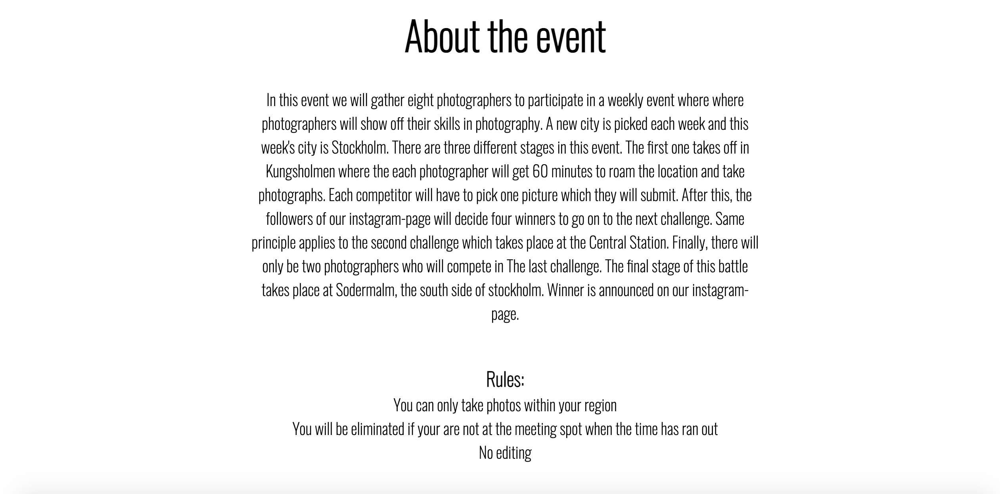
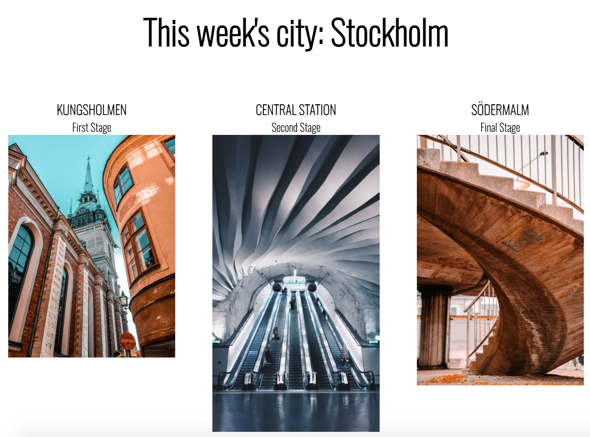

# Photography Battle
The Photography Battle website is a photography meet-up. In this event, photographers will enter a competition that takes place in three different locations in a city. A new city is picked every week and this week's pick is "Stockholm". Photographers who wins the battle will earn prices, such as camera gear. In addition to that, all photographers, or competitors will get recognized on our instagram page during the competition.
In order to participate in this challenge, users will use the sign up form to get a chance to compete against other photographers. The given time and the exact location for the first meet-up will be sent via an email. You can access the website here: [Photography Battle](https://wasim-eb.github.io/photography-battle/)

## Features

This is a fully responsive website. The page is divided into the four sections listed in the navbar. Where a colour background has been used it has a nice fitting color and the text is white. All of the headings used the font Lato and I feel this consistency has been used across the website to create a coherent design. I have chosen a picture that fits the theme of the webpage and gives it a nice contrast combined with the other elements.

### Navigation bar

The navigation bar at the right top of the page is used to navigate through the different sections on the website.
The font for the navigation bar is the same font being used throughout the whole website to keep everything stylish and fitting with the theme.
The navigation bar is easily visible and makes it easier to navigate through the website without having to scroll down to your desired section. When viewed on a smaller screen, the navigation bar turns into a Hamburger menu. 

### The About Page

This is where I introduce the event and all the information needed before and during the event. I also included a "Rules" section at the end of the page. 

### This Week's Location

This section shows us the city of the current week's Challenge. I have included the name of the city
in the header. Below the header, we get to see a picture and name of each of the locations where different stages of the challenge will take place. I wanted to keep this section as clean as possible,
and my choice of pictures will be representing the previous winners of each of the locations.

### Signup Form And Footer

The sign up form is used by the participants to sign up for the event. Eight participants are
randomly picked to join the Challenge. The participants will then receive all the necessary information for their next event. I was inspired by the movie "Need for Speed" where the competitors
for the Car race are randomly picked, and who then has 45 hours to reach the picked location.
The footer is very simple with the social media buttons. The background is a grayish color which I think fits in with the stylish background of a bridge in Stockholm.

## Testing

* I experimented with the webpage on different browsers such as: Chrome(main), firefox, and safari. 
* I also tested the webpage on the [Responsive Design](http://ami.responsivedesign.is/) platform. 
* I made sure to test it live on different mobile phones aswell to see if how responsive the website is, also how it would look on different screens.
* I confirmed that the website works in function and in looks.

## Bugs

* I experienced a problem when attempting to view my webpage live. Some pictures were not showing. I corrected this error by adding a dot in the img code:

Before:

After:

* The sign up form was visible at the center of the big image while viewing it on my laptop, but it was moved to the left while viewing it on my mobile phone.
* I fixed this by playing around the margin and padding codes. I am still struggling a little bit with this part in coding but I'm getting there.

## Validator testing

* The end result shows no errors in the HTML code. Check the results here: [W3C Validator](https://validator.w3.org/nu/?doc=https%3A%2F%2Fwasim-eb.github.io%2Fphotography-battle%2F)
* The CSS code is is also validated. Check the results here: [Jigsaw Validator](https://jigsaw.w3.org/css-validator/validator?uri=https%3A%2F%2Fwasim-eb.github.io%2Fphotography-battle%2F&profile=css3svg&usermedium=all&warning=1&vextwarning=&lang=es)
* No errors were found neither in the HTML nor the CSS code. 
* I used lighthouse in the dev tools in Google Chrome to confirm the accessibilty on both mobile devices and desktops.
---- Screenshot of the lighthouse performance ----

## Unfixed bugs
No unfixed bugs.

## Credits

### Coding content
* Most of my coding was used by myself.
* The idea behind the webpage was inspired by a photographer name Northborders on instagram.
* I took a lot of inspiration from the Love Running project.
* I used [W3Schools](https://www.w3schools.com/) as my main source for codes.
* I had to go back a few times and look at older coding from the previous lessons.

### Media
All of my pictures were downloaded from [Unsplash](https://unsplash.com/)

